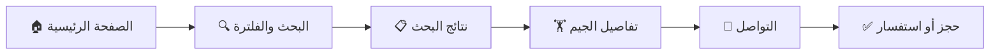

# 🏋️‍♂️ GymFinder Riyadh | جِم فايندر الرياض

<div align="center">

**Your Gateway to Fitness in Riyadh**  
**بوابتك للياقة البدنية في الرياض**

[](https://reactjs.org/)
[](https://fastapi.tiangolo.com/)
[](https://tailwindcss.com/)

*Discover, Compare, and Join the Best Gyms in Riyadh*  
*اكتشف، قارن، وانضم لأفضل صالات الرياضة بالرياض*

[Live Demo](#) • [Documentation](#) • [Report Bug](#)

</div>

---

## 🌟 What Makes Us Different | ايش يميزنا

**GymFinder Riyadh** مو بس موقع عادي للبحث عن الجيمات - هو تجربة متكاملة مصممة خصيصًا للسوق السعودي!

**GymFinder Riyadh** isn't just another gym directory - it's a complete fitness discovery platform crafted specifically for the Saudi market!

### ✨ Key Highlights | المميزات الرئيسية

- 🌍 **True Bilingual Experience** - واجهة ثنائية اللغة كاملة (عربي/إنجليزي) مع دعم RTL/LTR
- 🎯 **Smart Search & Filters** - ابحث بالاسم، الحي، أو نوع النادي بسهولة
- 📱 **Fully Responsive** - يشتغل على كل الأجهزة بسلاسة
- 🔐 **Secure Authentication** - نظام تسجيل دخول آمن ومحمي
- 📧 **Direct Contact System** - تواصل مباشر مع الأندية
- 👑 **Admin Dashboard** - لوحة تحكم شاملة لإدارة النظام
- ⚡ **Lightning Fast** - أداء فائق مع Redis caching

---

## 🚀 The Vision | الرؤية

في عالم يزداد فيه الوعي الصحي يوم بعد يوم، وجدنا أن الناس في الرياض يحتاجون منصة موثوقة وسهلة للعثور على النادي المناسب. **GymFinder Riyadh** جاء ليحل هذي المشكلة!

In a world where health awareness grows daily, we identified a gap: Riyadh needed a reliable, user-friendly platform to discover the perfect gym. **GymFinder Riyadh** fills that gap!

---

## 🎬 Features Showcase | استعراض المميزات

### 🔍 For Gym Seekers | للباحثين عن الجيمات

```
✓ اكتشف أفضل الجيمات حولك
✓ قارن الأسعار والخدمات
✓ شاهد الصور والتقييمات
✓ تواصل مباشرة مع الإدارة
✓ احفظ مفضلاتك في حسابك
```

### 👑 For Administrators | للمديرين

```
✓ إدارة كاملة للجيمات
✓ متابعة الرسائل والاستفسارات
✓ إدارة المستخدمين
✓ تحليلات وإحصائيات
✓ نظام آمن ومحمي
```

---

## 🏗️ Architecture | البنية التقنية

<div align="center">

```
┌─────────────────────────────────────────────────┐
│           Frontend - React + Vite                │
│    (TailwindCSS, Context API, Lucide Icons)     │
└──────────────────┬──────────────────────────────┘
                   │ RESTful APIs
                   ▼
┌─────────────────────────────────────────────────┐
│          Backend - FastAPI + SQLAlchemy          │
│     (Authentication, CRUD, Email Service)        │
└──────────────────┬──────────────────────────────┘
                   │
        ┌──────────┴──────────┐
        ▼                     ▼
   ┌─────────┐          ┌──────────┐
   │  SQLite │          │  Redis   │
   │   DB    │          │  Cache   │
   └─────────┘          └──────────┘
```

</div>

---

## 🛠️ Tech Stack | التقنيات المستخدمة

### Frontend الواجهة الأمامية
- ⚛️ **React 18+** with Vite - للأداء الفائق
- 🎨 **TailwindCSS** - للتصميم العصري
- 🎯 **Context API** - لإدارة الحالة
- 🔔 **Lucide Icons** - للأيقونات الجميلة

### Backend الخلفية
- 🚀 **FastAPI** - أسرع framework في Python
- 🗄️ **SQLAlchemy** - للتعامل مع قاعدة البيانات
- 🔐 **JWT Authentication** - للأمان
- 📧 **MailTrap** - لإرسال الإيميلات
- ⚡ **Redis** - للتخزين المؤقت

### DevOps الأدوات
- 🔄 **Alembic** - لإدارة الـ migrations
- 📦 **Uvicorn** - خادم ASGI عالي الأداء
- 🛡️ **CORS** - للأمان وإدارة الطلبات

---

## 📋 Quick Start | البداية السريعة

### المتطلبات | Prerequisites

```bash
• Python 3.8+
• Node.js 16+
• npm أو yarn
• Git
```

### التثبيت | Installation

#### 1️⃣ استنسخ المشروع | Clone the Repository

```bash
git clone https://github.com/yourusername/GymFinderRiyadh.git
cd GymFinderRiyadh
```

#### 2️⃣ اعداد الخلفية | Backend Setup

```bash
cd backend

# انشئ بيئة افتراضية
python3 -m venv venv

# فعّل البيئة الافتراضية
source venv/bin/activate  # Mac/Linux
# أو
venv\Scripts\activate     # Windows

# ثبّت المتطلبات
pip install -r requirements.txt

# شغّل الخادم
uvicorn app.main:app --reload
```

✅ الخلفية شغالة على `http://localhost:8000`

#### 3️⃣ اعداد الواجهة | Frontend Setup

```bash
cd frontend

# ثبّت الحزم
npm install

# شغّل السيرفر
npm run dev
```

✅ الموقع شغال على `http://localhost:5173`

---

## 🎯 How It Works | كيف يشتغل

### رحلة المستخدم | User Journey



---

## 🚧 Development Journey | رحلة التطوير

### المرحلة الأولى | Stage 1: Foundation
- ✅ إعداد البيئة التطويرية
- ✅ تصميم قاعدة البيانات
- ✅ استيراد بيانات الجيمات الأولية

### المرحلة الثانية | Stage 2: Backend Core
- ✅ بناء API endpoints
- ✅ نظام المصادقة والتوثيق
- ✅ عمليات CRUD للجيمات
- ✅ إعداد Alembic migrations

### المرحلة الثالثة | Stage 3: Frontend Magic
- ✅ تطوير المكونات الأساسية
- ✅ ربط الـ APIs
- ✅ نظام اللغات والـ Context

### المرحلة الرابعة | Stage 4: Advanced Features
- ✅ لوحة تحكم الأدمن
- ✅ نظام الإيميلات
- ✅ Redis caching
- ✅ تحسينات الأمان

### المرحلة النهائية | Final Stage: Polish
- ✅ تحويل لصفحة واحدة سلسة
- ✅ إضافة الأنيميشن
- ✅ تحسين الأداء
- ✅ التوثيق الشامل

---

## 💪 Challenges We Crushed | التحديات اللي تغلبنا عليها

| التحدي 🚧 | الحل 💡 |
|---------|--------|
| **استعلامات SQL بطيئة** | حسّنا الـ queries وضفنا Redis للكاش |
| **التبديل بين RTL/LTR** | استخدمنا Tailwind الديناميكي مع Context |
| **Header ثابت مع Smooth Scroll** | حسبنا ارتفاع الـ header وضبطنا الـ scroll |
| **اختبار الإيميلات** | دمجنا MailTrap للاختبار الآمن |
| **تحسين الصفحة الواحدة** | أعدنا هيكلة الكومبوننتس وقللنا الترانزشن |

---

## 🔮 Future Roadmap | خارطة الطريق

### قريب جدًا | Coming Soon
- [ ] 📊 لوحة تحليلات متقدمة
- [ ] 💳 نظام الدفع والاشتراكات
- [ ] 🗺️ تكامل مع Google Maps
- [ ] ⭐ نظام التقييمات والمراجعات

### قيد التخطيط | In Planning
- [ ] 📱 تطبيق موبايل (React Native)
- [ ] 🤖 توصيات ذكية مخصصة
- [ ] 🌙 الوضع الليلي
- [ ] ♿ تحسينات الوصول للجميع
- [ ] 📅 نظام الحجز المباشر

---

## 👥 The Dream Team | الفريق الحالم

<table>
  <tr>
    <td align="center">
      <br />
      <sub><b>Nada</b></sub><br />
      <sub>Project Lead & Frontend Design</sub>
    </td>
    <td align="center">
      <br />
      <sub><b>Shouq</b></sub><br />
      <sub>Frontend Design & QA</sub>
    </td>
    <td align="center">
      <br />
      <sub><b>Bushra</b></sub><br />
      <sub>UI Implementation & Backend</sub>
    </td>
    <td align="center">
      <br />
      <sub><b>Munira</b></sub><br />
      <sub>Data Integration</sub>
    </td>
  </tr>
</table>

---

## 📜 License | الترخيص

This project is licensed under the **MIT License** - شوف ملف [LICENSE](LICENSE) للتفاصيل

```
مفتوح المصدر ♥ يعني تقدر تستخدمه، تعدله، وتوزعه بحرية
```

---

## 🙏 Acknowledgments | شكر وتقدير

<div align="center">

### شكرًا خاصًا لـ | Special Thanks To

**🎓 Tuwaiq Academy**  
على دعمهم المستمر وتوفير بيئة تعليمية ممتازة

**🎓 Holberton School**  
على التدريب العملي المكثف في تطوير Full Stack

---

بدونهم، ما كان هالمشروع يشوف النور! 🌟  
*Without them, this project wouldn't have seen the light!*

</div>

---

## 📞 Contact & Support | التواصل والدعم

وجدت مشكلة؟ عندك اقتراح؟ حابب تساهم؟  
*Found a bug? Have a suggestion? Want to contribute?*

- 🐛 [Report Issues](https://github.com/yourusername/GymFinderRiyadh/issues)
- 💡 [Feature Requests](https://github.com/yourusername/GymFinderRiyadh/issues/new)
- 📧 Email: support@gymfinder.sa

---

<div align="center">

### صُنع بـ ❤️ في الرياض | Made with ❤️ in Riyadh

**Star ⭐ the repo if you like it!**  
**نجمّ المشروع اذا عجبك! ⭐**

[⬆ Back to Top](#-gymfinder-riyadh--جم-فايندر-الرياض)

</div>
